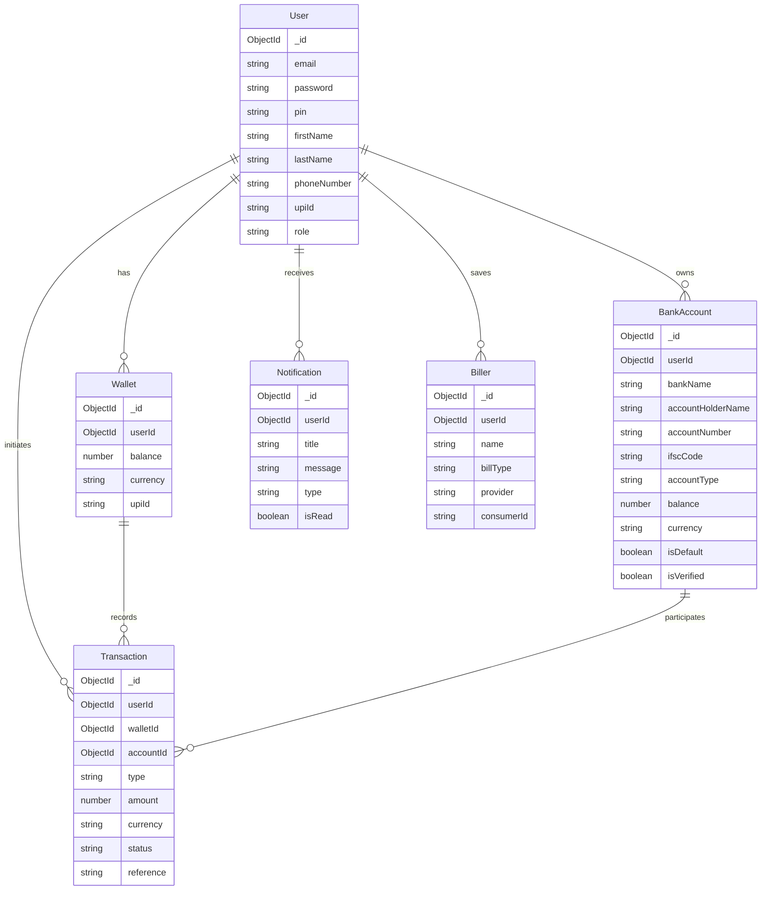
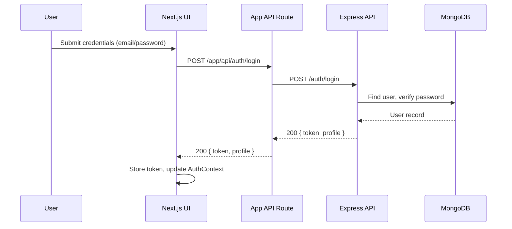
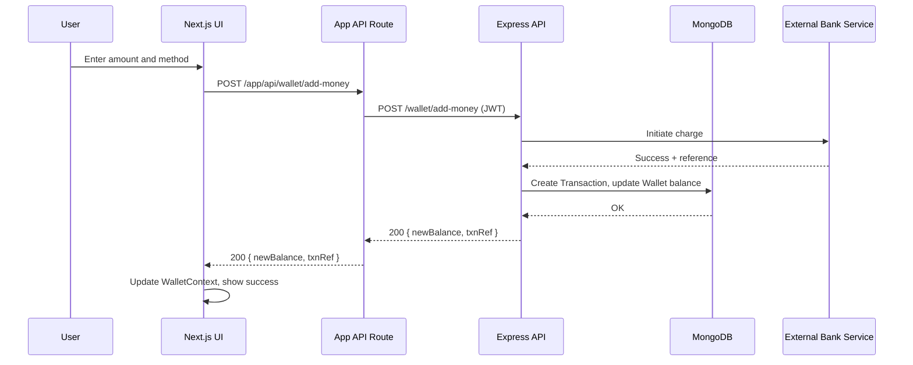

# Banking Platform

A full-stack banking platform with React frontend and Node.js backend.

## Architecture

- Frontend (Next.js): see `banking-app/ARCHITECTURE.md`
- Backend (Express): see `backend/ARCHITECTURE.md`

## System Architecture

```mermaid
flowchart LR
  subgraph Client
    U((User))
  end

  subgraph Frontend[Next.js App]
    UI[Pages & Components]
    API[App API Routes (app/api/*)]
  end

  subgraph Backend[Express API]
    ROUTER[Routers]
    MW[Auth Middleware]
    C_AUTH[Auth Controller]
    C_USER[User Controller]
    C_WALLET[Wallet Controller]
    C_BANK[BankAccount Controller]
    C_TXN[Transaction Controller]
    C_PAY[Payment Controller]
  end

  DB[(MongoDB)]
  EXT[[External Bank Service]]

  U --> UI
  UI -->|fetch| API
  API -->|REST JSON| ROUTER
  UI -. optional direct .-> ROUTER
  ROUTER --> MW
  MW --> C_AUTH
  MW --> C_USER
  MW --> C_WALLET
  MW --> C_BANK
  MW --> C_TXN
  MW --> C_PAY
  C_AUTH --> DB
  C_USER --> DB
  C_WALLET --> DB
  C_BANK --> DB
  C_TXN --> DB
  C_PAY --> DB
  C_BANK -->|balance/transfer| EXT
  C_PAY -->|card/qr| EXT
  ROUTER --> API
  API --> UI
```

## Data Flow Diagram

```mermaid
flowchart LR
  %% Client
  subgraph client[Client]
    user((End User))
  end

  %% Frontend
  subgraph fe[Next.js Frontend]
    ui[UI Pages & Components]
    apiRoutes[App API Routes\n(app/api/*)]
  end

  %% Backend
  subgraph be[Express Backend]
    server[Express Server]
    mw[Auth Middleware]
    ctrl_auth[Auth Controller]
    ctrl_wallet[Wallet Controller]
    ctrl_bank[Bank Account Controller]
    ctrl_payment[Payment Controller]
    ctrl_txn[Transaction Controller]
  end

  %% Data stores / external
  db[(MongoDB)]
  ext[[External Bank Service]]

  %% Flow
  user -->|HTTP(S)| ui
  ui -->|1) fetch /app/api/*| apiRoutes
  apiRoutes -->|2) REST JSON| server
  ui -. optional direct REST .->|REST JSON| server

  server -->|3) verify JWT| mw
  mw -->|4) route handler| ctrl_auth
  mw --> ctrl_wallet
  mw --> ctrl_bank
  mw --> ctrl_payment
  mw --> ctrl_txn

  ctrl_auth -->|CRUD| db
  ctrl_wallet -->|CRUD| db
  ctrl_bank -->|CRUD| db
  ctrl_payment -->|CRUD| db
  ctrl_txn -->|CRUD| db

  ctrl_bank -->|transfer/balance| ext
  ctrl_payment -->|charge/refund| ext
  ext --> server
  db --> server

  server -->|5) JSON response| apiRoutes
  apiRoutes -->|6) hydrate UI| ui
```

## Entity Relationship Diagram (ERD)



## Sequence Diagrams

### Auth Login


### Add Money to Wallet


Legend:
- client: user’s browser or device
- fe: Next.js UI and API routes used as a server-side proxy/normalizer
- be: Express app with auth middleware and domain controllers
- db: MongoDB for persistence; ext: external/mock bank rails

## Folder Structure

```
banking-platform/
├─ backend/
│  ├─ config/                 # Third‑party and environment configs (e.g., firebase)
│  ├─ controllers/            # Express controllers with business logic per domain
│  ├─ middleware/             # Cross‑cutting middlewares (auth, validation)
│  ├─ models/                 # Mongoose schemas and models
│  ├─ routes/                 # Express routers per domain
│  ├─ services/               # External integrations (e.g., mock bank service)
│  ├─ utils/                  # Helpers and utilities (e.g., OTP utils)
│  ├─ scripts/                # Maintenance/admin scripts
│  ├─ server.js               # App bootstrap and route registration
│  ├─ test-db.js              # Connectivity test helpers
│  └─ ARCHITECTURE.md         # Backend architecture overview
│
├─ banking-app/
│  ├─ app/                    # Next.js App Router pages and API routes
│  │  ├─ api/                 # Server route handlers (proxy/normalize backend calls)
│  │  ├─ auth/                # Auth flows (login/register)
│  │  ├─ dashboard/           # Dashboard route
│  │  ├─ wallet/              # Wallet routes (add money, overview)
│  │  ├─ banks/               # Banks list and actions
│  │  ├─ bank-accounts/       # Linked accounts UI
│  │  ├─ bills/               # Bills and billers
│  │  ├─ notifications/       # Notifications center
│  │  ├─ profile/             # Profile and settings routes
│  │  ├─ layout.tsx           # App shell
│  │  └─ globals.css          # Global styles (app‑scoped)
│  ├─ components/             # UI and feature components grouped by domain
│  ├─ context/                # React contexts (auth, wallet)
│  ├─ hooks/                  # Reusable React hooks
│  ├─ lib/                    # Library helpers (e.g., `utils.ts`)
│  ├─ public/                 # Static assets
│  ├─ styles/                 # Tailwind/global CSS (project‑level)
│  ├─ utils/                  # Client API helpers (REST wrappers)
│  ├─ ARCHITECTURE.md         # Frontend architecture overview
│  └─ next.config.mjs         # Next.js configuration
│
├─ package.json               # Root scripts (orchestration) and workspace info
├─ README.md                  # Project overview and getting started
└─ pnpm-lock.yaml / package-lock.json
```

Key conventions:
- Group backend code by domain in `routes/` and `controllers/` with shared logic in `services/`.
- In the frontend, co‑locate UI by feature under `components/<domain>` and keep network calls in `utils/` or `app/api/*` route handlers.

## Quick Start

### Option 1: Start Both Servers (Recommended)
```bash
# Install dependencies for all projects
npm run install:all

# Start both backend and frontend servers
npm run dev
```

### Option 2: Start Servers Separately

**Backend (Port 3001):**
```bash
cd backend
npm start
```

**Frontend (Port 3000):**
```bash
cd banking-app
npm run dev
```

## Testing the Application

### 1. Registration Flow
1. Go to `http://localhost:3000/auth/register`
2. Enter phone number and email
3. **Check backend console for OTP logs:**
   - Phone OTP: `🔐 [PHONE VERIFICATION] Use this OTP: 123456`
   - Email OTP: `📧 [EMAIL VERIFICATION] Use this OTP: 123456`
4. Use the OTPs shown in console to verify
5. Complete registration with personal details

### 2. Login Flow
1. Go to `http://localhost:3000/auth/login`
2. Use email/password or phone/OTP
3. Should redirect to dashboard

### 3. Wallet Features
1. Go to `http://localhost:3000/wallet`
2. Click "Add Money" to add funds
3. View transaction history
4. Check wallet balance

## Features Implemented

✅ **Fully Functional Authentication**
- Email/password login
- Phone/OTP login
- User session management

✅ **Phone & Email Verification on One Page**
- Combined verification flow
- Real-time OTP validation

✅ **OTP Console Logging**
- Clear console output with emojis
- Easy to identify OTPs for testing

✅ **Frontend User Data in MongoDB**
- Complete user profile storage
- Wallet initialization with 0 balance

✅ **Add Money Functionality**
- Multiple payment methods
- Real-time balance updates
- Transaction history

## Console OTP Logs

When testing, you'll see logs like:
```
🔐 [PHONE VERIFICATION] Generated OTP for 1234567890: 123456
📱 [PHONE VERIFICATION] Use this OTP: 123456
✅ [PHONE VERIFICATION] OTP stored in database for 1234567890

📧 [EMAIL VERIFICATION] Generated OTP for user@example.com: 654321
✉️ [EMAIL VERIFICATION] Use this OTP: 654321
✅ [EMAIL VERIFICATION] OTP stored in database for user@example.com
```

## Troubleshooting

- **Backend not starting:** Make sure you're in the `backend` directory
- **Frontend not starting:** Make sure you're in the `banking-app` directory
- **OTP not showing:** Check backend console logs
- **CORS errors:** Backend is configured for port 3000 and 3001

## Technical Stack & Package Report

### Overview
- **Monorepo Layout:** Root orchestrates scripts for `backend` (Express + MongoDB) and `banking-app` (Next.js).
- **Frontend:** Next.js 15 (App Router), React 19, Tailwind CSS, Radix UI primitives, form validation with `react-hook-form` + `zod`, charts via `recharts`.
- **Backend:** Node.js + Express 5, MongoDB via Mongoose 8, JWT auth, sessions (Mongo store), OTP via `speakeasy`, email via `nodemailer`, SMS via `twilio`.
- **Tooling:** `concurrently` for running both apps, PostCSS/Tailwind build pipeline.

### Root Workspace

#### Scripts
- **dev**: Runs backend and frontend together with `concurrently`.
- **dev:backend**: Starts backend (`backend/server.js`).
- **dev:frontend**: Starts Next.js dev server in `banking-app`.
- **install:all**: Installs deps at root, then backend, then frontend.
- **start:backend / start:frontend**: Convenience wrappers.

#### Dependencies
| Package | Version | Purpose |
|---|---:|---|
| connect-mongo | ^5.1.0 | Shared reference; primary usage is in backend for session store |

#### DevDependencies
| Package | Version | Purpose |
|---|---:|---|
| concurrently | ^8.2.2 | Run backend and frontend in parallel from the root |

### Backend (Express API)

#### Scripts
- **start**: `node server.js`
- **dev**: `nodemon server.js` (hot reload)

#### Dependencies
| Package | Version | Purpose |
|---|---:|---|
| express | ^5.1.0 | HTTP server and routing |
| cors | ^2.8.5 | Cross-origin resource sharing for frontend <-> backend |
| helmet | ^8.1.0 | Secure HTTP headers |
| morgan | ^1.10.0 | HTTP request logging |
| dotenv | ^16.5.0 | Environment variable loading |
| mongoose | ^8.14.1 | MongoDB ODM for schemas/models |
| jsonwebtoken | ^9.0.2 | JWT signing/verification for stateless auth |
| bcryptjs | ^3.0.2 | Password hashing |
| express-session | ^1.18.1 | Session management (when needed) |
| connect-mongo | ^5.1.0 | Mongo-backed session store |
| express-list-endpoints | ^7.1.1 | Inspect/print registered routes (debugging/docs) |
| nodemailer | ^6.9.12 | Send transactional emails (e.g., OTP/email verification) |
| twilio | ^4.22.0 | Send SMS (e.g., OTP to phone) |
| speakeasy | ^2.0.0 | Time-based OTP generation/verification |

#### DevDependencies
| Package | Version | Purpose |
|---|---:|---|
| nodemon | ^3.1.10 | Auto-restart server during development |

#### Notable Backend Modules
- `controllers/*`: Domain logic for auth, wallet, bank accounts, payments, transactions.
- `middleware/auth.middleware.js`: JWT verification and user extraction.
- `models/*`: Mongoose schemas for `User`, `Wallet`, `BankAccount`, `Transaction`, `Notification`, `Biller`.
- `services/mockBankService.js`: Simulated external bank rails (balance/transfer, card/QR flows).
- `utils/otpUtils.js`: Helper utilities for OTP generation/storage.

### Frontend (Next.js App)

#### Scripts
- **dev**: `next dev`
- **build**: `next build`
- **start**: `next start`
- **lint**: `next lint`

#### Dependencies
| Package | Version | Purpose |
|---|---:|---|
| next | 15.2.4 | React framework (App Router) |
| react | ^19 | UI library |
| react-dom | ^19 | React DOM renderer |
| tailwindcss | ^3.4.17 | Utility-first CSS framework (via devDependencies) |
| autoprefixer | ^10.4.20 | Vendor prefixing for CSS |
| postcss | ^8 | CSS processing pipeline |
| next-themes | ^0.4.6 | Theme toggling (light/dark/system) |
| class-variance-authority | ^0.7.1 | Variant-based styling utilities |
| clsx | ^2.1.1 | Conditional className builder |
| tailwind-merge | ^2.5.5 | Merge Tailwind class strings safely |
| tailwindcss-animate | ^1.0.7 | Prebuilt animations for Tailwind |
| @radix-ui/* (accordion, dialog, etc.) | 1.x/2.x | Accessible headless UI primitives |
| lucide-react | ^0.454.0 | Icon set for React |
| cmdk | 1.0.4 | Command palette components |
| embla-carousel-react | 8.5.1 | Carousel support |
| react-resizable-panels | ^2.1.7 | Resizable panel layouts |
| recharts | 2.15.0 | Charts (dashboard/analytics) |
| date-fns | 4.1.0 | Date utilities |
| react-day-picker | 8.10.1 | Calendar/date picker |
| react-hook-form | ^7.54.1 | Form state management |
| @hookform/resolvers | ^3.9.1 | Bridge between RHF and schema validators |
| zod | ^3.24.1 | Schema validation and parsing |
| sonner | ^1.7.1 | Toast notifications |
| qrcode.react | ^4.2.0 | Render QR codes |
| react-qr-reader | ^3.0.0-beta-1 | Read/scan QR codes |
| input-otp | 1.4.1 | OTP input UI component |
| vaul | ^0.9.6 | Drawer/sheet components |

#### DevDependencies
| Package | Version | Purpose |
|---|---:|---|
| typescript | ^5 | TypeScript language support |
| @types/node | ^22 | Type definitions for Node APIs |
| @types/react | ^19 | React type definitions |
| @types/react-dom | ^19 | React DOM type definitions |

### Environment & Configuration
- Backend uses `dotenv`; expected variables commonly include MongoDB URI, JWT secret, email/Twilio credentials.
- CORS is configured to allow frontend (localhost:3000) to call backend (localhost:3001).
- Frontend API calls are routed via `app/api/*` handlers or client utilities in `banking-app/utils/*`.

### Security & Auth Notes
- Passwords hashed with `bcryptjs`.
- JWT used for stateless auth; optional `express-session` with `connect-mongo` for session-backed features.
- `helmet` for hardened HTTP headers; validate inputs on both client (`zod`) and server.

### Observability & DX
- `morgan` logs HTTP requests in backend.
- `express-list-endpoints` can enumerate routes for quick inspection.
- `nodemon` for backend hot reload; Next.js provides Fast Refresh for frontend.

### External Integrations
- `twilio` for SMS OTP delivery.
- `nodemailer` for email OTP and notifications.
- `services/mockBankService.js` mocks external banking rails for transfers, balance checks, and payments.

### Where Things Live
- Frontend pages/components under `banking-app/app` and `banking-app/components`.
- Backend domain logic under `backend/controllers` with routing in `backend/routes` and schemas in `backend/models`.

## Payments (Card & QR)

### Backend Endpoints
- `POST /payments/card-payment` (JWT)
  - Body: `{ cardNumber: string, cardType: string, amount: number }`
  - Effect: Creates a `Transaction` of type `card_payment` and records masked card details; demo-only, no external charge.
  - Response: `{ message, transaction }`

- `POST /payments/qr` (JWT + PIN)
  - Middlewares: `auth`, `verifyPin`
  - Body: `{ recipientId: ObjectId, amount: number }`
  - Effect: Atomic transfer between wallets using MongoDB session/transaction; creates sender and recipient `Transaction`s and `Notification`s.
  - Response: `{ status: 'success', message, data: { newBalance, transaction } }`

Notes:
- `verifyPin` pulls `pin` from the request body and verifies it against the user’s stored PIN (`User.verifyPin`).
- Insufficient funds and missing wallets return appropriate `4xx` errors.

### Frontend API Routes (Proxy)
- `app/api/payments/card-payment/route.ts`
- `app/api/payments/qr/route.ts`
  - Proxies to backend using `BACKEND_URL` (defaults to `http://localhost:5000` in code). Ensure this matches your backend port (e.g., `http://localhost:3001`).
  - Required headers: `Authorization: Bearer <JWT>`
  - `qr` route expects `{ recipientId, amount, pin }` and forwards to backend.

### Typical QR Payment Flow
1. User scans a QR containing the recipient’s `userId` or UPI-like identifier.
2. UI collects `amount` and `pin`.
3. Frontend calls `POST /app/api/payments/qr` with JWT.
4. Frontend route forwards to backend `POST /payments/qr` with same payload and token.
5. Backend verifies JWT and PIN, executes wallet transfer in a transaction, creates notifications.
6. Frontend receives updated balance and transaction reference; updates Wallet context and shows success toast.

### Sequence (QR Payment)
```mermaid
sequenceDiagram
  participant U as User
  participant UI as Next.js UI
  participant API as App API Route
  participant BE as Express API
  participant DB as MongoDB

  U->>UI: Scan QR, enter amount + PIN
  UI->>API: POST /app/api/payments/qr { recipientId, amount, pin }
  API->>BE: POST /payments/qr (Bearer JWT)
  BE->>DB: Start session; update sender/recipient wallets
  DB-->>BE: OK; transactions + notifications saved
  BE-->>API: 200 { newBalance, transaction }
  API-->>UI: 200 { newBalance, transaction }
  UI->>UI: Update wallet state; show success
```

### Environment
- Backend: set `JWT_SECRET`, `MONGODB_URI`, and optionally email/SMS creds for OTP.
- Frontend: set `BACKEND_URL` to your Express base URL (e.g., `http://localhost:3001`).
